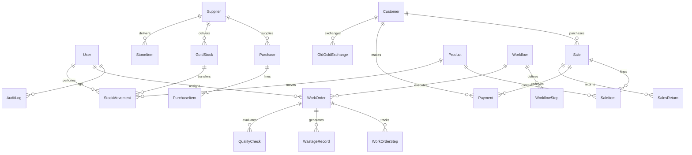

# S.S JEWELLERY ERP — Codebase Technical Audit Report

**Date**: October 2026  
**Auditor**: Senior Full-Stack Engineer  
**Scope**: Complete Architecture, State Mutations, Calculations, Financial & Weight Logic, Security, and Bug Analysis  
**Repository**: `ssjewellers-main`

---

## 1. Executive Summary

A comprehensive architectural and code-level audit was performed on the existing "SS Jewellery ERP" codebase. The project is currently a client-side React 19 / Next.js 16 application persisting state entirely to `localStorage` via Zustand (`ss-jewellery-erp-v2`).

While the user interface is visually rich and feature-complete across 13 core operational modules, the underlying data layer suffers from critical structural vulnerabilities:
1. **Authoritative Client Logic**: The client calculates prices, discounts, taxes, and manages stock decrements without server validation.
2. **Floating-Point Precision Risks**: Money (INR) and gold weights (grams) are computed using standard JavaScript floating-point numbers (`number`, `parseFloat`, `Math.round`, `.toFixed()`).
3. **Broken Invariants & State Inconsistencies**: Financial and inventory deletions leave corrupted or unsynchronized balances (e.g., deleting a sale does not restore product inventory or customer ledger balances).
4. **Security Vulnerabilities**: Plaintext passwords, mock client-side authentication, and exposed database query logs in production.

This audit establishes the baseline for the multi-phase transition to a production-grade, multi-user relational ERP on PostgreSQL.

---

## 2. Complete Inventory of State Mutations

All state mutations in the current system occur directly on the client in [`src/lib/store.ts`](file:///c:/AROHON%20FILES/ssjewellers-main/ssjewellers-main/src/lib/store.ts) and through component dialog handlers.

| Entity / Action | Method in Store | State Mutated | Side Effects / Cascade Logic | Audit Finding / Inconsistency |
| :--- | :--- | :--- | :--- | :--- |
| **User Login** | `login()` | `currentUser`, `users[i].lastLogin` | Adds `LOGIN` entry to `auditLogs` | Plaintext string comparison against unhashed passwords. |
| **User Logout** | `logout()` | `currentUser` | Adds `LOGOUT` entry to `auditLogs` | Purely client-side state reset. |
| **Create User** | `addUser()` | `users` | Generates ID `usr-*`, logs `CREATE_USER` | No password complexity validation or hashing. |
| **Update User** | `updateUser()` | `users` | Modifies user properties, logs `UPDATE_USER` | Can modify own role without privilege escalation checks. |
| **Delete User** | `deleteUser()` | `users` | Filters out user by ID, logs `DELETE_USER` | Does not verify if user has active assigned work orders. |
| **Create Sale** | `addSale()` | `sales`, `customers`, `settings.invoiceSeq` | Increments customer purchase/paid/due, decrements product stock, logs action | **Client-calculated values**. Generates invoice prefix client-side. |
| **Update Sale** | `updateSale()` | `sales` | Replaces sale attributes | Does not recalculate customer ledgers or product stock. |
| **Delete Sale** | `deleteSale()` | `sales` | Filters out sale by ID | ❌ **CRITICAL BUG**: Does NOT restore decremented product stock. Does NOT reverse customer `totalPurchase`, `totalPaid`, `totalDue`, or `totalBills`. |
| **Add Payment** | `addPayment()` | `payments`, `sales`, `customers` | Updates `sale.paidAmount`, `sale.dueAmount`, `sale.status`, `customer.totalPaid`, `customer.totalDue` | Floating-point subtraction can create micro-cent rounding errors. |
| **Delete Payment** | `deletePayment()` | `payments` | Filters out payment by ID | ❌ **CRITICAL BUG**: Does NOT restore customer due balances or invoice payment status. |
| **Create Purchase** | `addPurchase()` | `purchases`, `settings.purchaseSeq`, `suppliers` | Increments `supplier.totalPurchase` & `supplier.totalPaid` | Does not update raw gold inventory automatically. |
| **Update Purchase** | `updatePurchase()` | `purchases` | Replaces purchase attributes | Does not adjust supplier balances. |
| **Delete Purchase** | `deletePurchase()` | `purchases` | Filters out purchase by ID | ❌ **CRITICAL BUG**: Does NOT reverse supplier `totalPurchase` or `totalPaid`. |
| **Add Gold Stock** | `addGoldStock()` | `goldStock` | Adds gold stock entry, logs `CREATE_GOLD_STOCK` | Fine gold weight computed via client math. |
| **Update Gold Stock** | `updateGoldStock()` | `goldStock` | Modifies gold stock properties | Can edit stock in-place without generating a StockMovement. |
| **Delete Gold Stock** | `deleteGoldStock()` | `goldStock` | Filters out gold stock by ID | Hard delete; destroys traceability of lot numbers. |
| **Stock Movement** | `addStockMovement()` | `stockMovements` | Appends movement log | Does not check source location availability. |
| **Stock Adjustment** | `addStockAdjustment()` | `stockAdjustments` | Appends adjustment log | Does not directly alter `goldStock` or `products` quantities automatically. |
| **Add Stone** | `addStone()` | `stones` | Appends stone item | Computes `remainingQuantity = quantity - usedQuantity` on client. |
| **Update Stone** | `updateStone()` | `stones` | Modifies stone properties | Recomputes remaining quantity on client. |
| **Delete Stone** | `deleteStone()` | `stones` | Filters out stone by ID | Hard delete without checking product usage. |
| **Add Product** | `addProduct()` | `products` | Adds product record, logs `CREATE_PRODUCT` | Barcode generated via pseudo-random Math.random(). |
| **Update Product** | `updateProduct()` | `products` | Modifies product record | No concurrency token/version check. |
| **Delete Product** | `deleteProduct()` | `products` | Filters out product by ID | Hard delete even if referenced in historical sales bills. |
| **Decrement Stock** | `decrementProductStock()` | `products` | Decrements `stock` with `Math.max(0, stock - qty)` | Silently swallows negative stock instead of rejecting. |
| **Add Work Order** | `addWorkOrder()` | `workOrders`, `settings.workOrderSeq` | Appends initial history entry, increments sequence | Sequence not protected against concurrent duplicate numbers. |
| **Update Work Step** | `updateWorkStep()` | `workOrders[i].steps` | Modifies step status, weights, remarks | Loss/wastage recorded on client. |
| **Add Wastage** | `addWastageRecord()` | `wastageRecords` | Appends wastage entry | Float division `(wastage / inputWeight) * 100`. |
| **Add Exchange** | `addExchange()` | `exchanges` | Appends exchange voucher | Does not update cash in drawer or raw gold scrap inventory. |
| **Delete Exchange** | `deleteExchange()` | `exchanges` | Filters out voucher by ID | Hard delete of financial voucher. |
| **Reset Data** | `resetAll()` | All collections | Overwrites everything with `seed-data.ts` | Complete client-side reset. |

---

## 3. Comprehensive Inventory of Money and Weight Calculations

### 3.1 Financial Calculations (Money)

| Location | Formula / Code Expression | Potential Failure Mode & Precision Risk |
| :--- | :--- | :--- |
| [`sales.tsx:226`](file:///c:/AROHON%20FILES/ssjewellers-main/ssjewellers-main/src/components/jewellery/sales.tsx#L226) | `rate = p.sellingPrice - p.makingCharge - (p.stoneWeight > 0 ? 0 : 0)` | **Dead Code & Logic Bug**: `(p.stoneWeight > 0 ? 0 : 0)` evaluates to `0` unconditionally. Rate calculation is inaccurate. |
| [`sales.tsx:232`](file:///c:/AROHON%20FILES/ssjewellers-main/ssjewellers-main/src/components/jewellery/sales.tsx#L232) | `discount: 0, gstRate: 0, gstAmount: 0, total: subtotal` | **GST Hardcoded to 0**: GST is ignored during bill item creation. |
| [`sales.tsx:247`](file:///c:/AROHON%20FILES/ssjewellers-main/ssjewellers-main/src/components/jewellery/sales.tsx#L247) | `grandTotal = Math.max(0, subtotal - oldGoldAdj)` | Floating-point subtraction can introduce fractional cents. |
| [`sales.tsx:342`](file:///c:/AROHON%20FILES/ssjewellers-main/ssjewellers-main/src/components/jewellery/sales.tsx#L342) | `dueAmount = status === 'PAID' ? 0 : Math.max(0, totals.grandTotal - amountPaid)` | Split payment arithmetic done purely on client. |
| [`purchase.tsx:285`](file:///c:/AROHON%20FILES/ssjewellers-main/ssjewellers-main/src/components/jewellery/purchase.tsx#L285) | `total = (rate * netWeight) + makingCharges + tax` | Float multiplication (`rate * netWeight`) can produce fractional paise. |
| [`exchange.tsx:233`](file:///c:/AROHON%20FILES/ssjewellers-main/ssjewellers-main/src/components/jewellery/exchange.tsx#L233) | `total = netWeight * ratePerGram` -> `Math.round(total)` | Rounding errors on fractional touch percentages. |
| [`exchange.tsx:255`](file:///c:/AROHON%20FILES/ssjewellers-main/ssjewellers-main/src/components/jewellery/exchange.tsx#L255) | `rate = Math.round((24kRate * touch) / 100)` | Fixed round without fractional paise preservation. |
| [`store.ts:460-466`](file:///c:/AROHON%20FILES/ssjewellers-main/ssjewellers-main/src/lib/store.ts#L460-L466) | `totalPurchase += grandTotal`, `totalPaid += paidAmount`, `totalDue += dueAmount` | Cumulative floating point additions drift over time. |
| [`store.ts:559-565`](file:///c:/AROHON%20FILES/ssjewellers-main/ssjewellers-main/src/lib/store.ts#L559-L565) | `formatCurrency(n)` -> `Math.round(n * 100) / 100` | UI formatting helper masks internal precision loss. |

### 3.2 Weight & Material Calculations

| Location | Formula / Code Expression | Potential Failure Mode & Precision Risk |
| :--- | :--- | :--- |
| [`gold-inventory.tsx:298`](file:///c:/AROHON%20FILES/ssjewellers-main/ssjewellers-main/src/components/jewellery/gold-inventory.tsx#L298) | `fineGoldWeight = (grossWeight * purityPct) / 100` | Stored as floating point; fine gold balance can drift. |
| [`workflow-view.tsx:578`](file:///c:/AROHON%20FILES/ssjewellers-main/ssjewellers-main/src/components/jewellery/workflow-view.tsx#L578) | `wastage = inputWeight - outputWeight` | Precision loss on milligram measurements (`0.3000000000000007g`). |
| [`workflow-view.tsx:594`](file:///c:/AROHON%20FILES/ssjewellers-main/ssjewellers-main/src/components/jewellery/workflow-view.tsx#L594) | `wastagePercent = (wastage / inputWeight) * 100` | Unchecked division by zero if `inputWeight` is 0. |
| [`customers.tsx:126-132`](file:///c:/AROHON%20FILES/ssjewellers-main/ssjewellers-main/src/components/jewellery/customers.tsx#L126-L132) | `totalPurchaseGrams = totalPurchase / defaultGoldRate24K` | **Flawed Logic**: Estimating purchased gold grams by dividing total invoice amount (which includes diamonds, silver, stones, and making charges) by 24K rate. |
| [`stone-inventory.tsx:394`](file:///c:/AROHON%20FILES/ssjewellers-main/ssjewellers-main/src/lib/store.ts#L394) | `remainingQuantity = quantity - usedQuantity` | Integer subtraction on client without concurrency validation. |

---

## 4. Detailed Audit of Bugs & Vulnerabilities Found

### Bug 1: Deleting a Sale Corrupts Stock & Customer Balances
- **Location**: [`src/lib/store.ts:474`](file:///c:/AROHON%20FILES/ssjewellers-main/ssjewellers-main/src/lib/store.ts#L474) (`deleteSale`)
- **Impact**: High / Data Loss.
- **Description**: When a sale is created in `addSale`, `product.stock` is decremented and `customer.totalPurchase`, `customer.totalPaid`, `customer.totalDue`, `customer.totalBills` are incremented. However, `deleteSale` simply filters out the sale record from `sales` array:
  ```typescript
  deleteSale: (id) => set((s) => ({ sales: s.sales.filter((sl) => sl.id !== id) }))
  ```
  The deducted product inventory is **never restored**, customer credit balances remain permanently distorted, and any recorded payments linked to the invoice become orphaned.

### Bug 2: Deleting a Purchase Does Not Reconcile Supplier Ledgers
- **Location**: [`src/lib/store.ts:441`](file:///c:/AROHON%20FILES/ssjewellers-main/ssjewellers-main/src/lib/store.ts#L441) (`deletePurchase`)
- **Impact**: High / Financial Inconsistency.
- **Description**: `addPurchase` increments `supplier.totalPurchase` and `supplier.totalPaid`. `deletePurchase` removes the purchase item without decrementing the supplier’s recorded purchase volume or reversing payables.

### Bug 3: Dead Code & Bypassed GST in Sales Billing
- **Location**: [`src/components/jewellery/sales.tsx:226, 232`](file:///c:/AROHON%20FILES/ssjewellers-main/ssjewellers-main/src/components/jewellery/sales.tsx#L226)
- **Impact**: Medium / Billing Inaccuracy.
- **Description**:
  ```typescript
  const rate = p.sellingPrice - p.makingCharge - (p.stoneWeight > 0 ? 0 : 0)
  ```
  `(p.stoneWeight > 0 ? 0 : 0)` is dead code that always evaluates to 0. Furthermore, line 232 hardcodes `gstRate: 0, gstAmount: 0`, meaning newly created bills bypass statutory GST calculations configured in Store Settings.

### Bug 4: Nonsensical Customer Weight Calculation in Customer Profile Dialog
- **Location**: [`src/components/jewellery/customers.tsx:125-135`](file:///c:/AROHON%20FILES/ssjewellers-main/ssjewellers-main/src/components/jewellery/customers.tsx#L125-L135)
- **Impact**: Medium / UI Metric Error.
- **Description**: When displaying the customer’s lifetime gold purchase in grams, if historical sale items are missing from cache, the code falls back to `viewC.totalPurchase / fallbackRate` (dividing total INR amount by today's 24K gold rate). This incorrectly converts making charges, diamond values, and silver purchases into hypothetical 24K gold grams.

### Bug 5: Plaintext Passwords & Client-Side Authentication Bypass
- **Location**: [`src/components/jewellery/login-page.tsx:17-22`](file:///c:/AROHON%20FILES/ssjewellers-main/ssjewellers-main/src/components/jewellery/login-page.tsx#L17-L22), [`src/components/jewellery/users.tsx:163`](file:///c:/AROHON%20FILES/ssjewellers-main/ssjewellers-main/src/components/jewellery/users.tsx#L163)
- **Impact**: Critical / Security Vulnerability.
- **Description**:
  - Legacy demo accounts previously hardcoded plaintext passwords into the client bundle.
  - User creation in `users.tsx` exposes the password in an `<Input type="text">` plaintext field.
  - Authentication checks occur on the browser by querying `get().users.find(...)`. Anyone opening DevTools can read or modify any user credentials and permissions.

### Bug 6: Sequence Gaps & Concurrent Numbering Collisions
- **Location**: [`src/lib/store.ts:310, 429, 454`](file:///c:/AROHON%20FILES/ssjewellers-main/ssjewellers-main/src/lib/store.ts#L310)
- **Impact**: High / Regulatory Non-Compliance.
- **Description**: Invoice numbers (`INV-2026-00126`), purchase IDs (`PUR-2026-0018`), and work order IDs (`WF-10030`) rely on an un-locked sequence integer stored in browser localStorage or array length. In a multi-user environment, concurrent billing will generate duplicate invoice numbers or leave audit gaps.

### Bug 7: Silent Negative Inventory Acceptance
- **Location**: [`src/lib/store.ts:417`](file:///c:/AROHON%20FILES/ssjewellers-main/ssjewellers-main/src/lib/store.ts#L417) (`decrementProductStock`)
- **Impact**: Medium / Inventory Discrepancy.
- **Description**:
  ```typescript
  decrementProductStock: (id, qty) => {
    set((s) => ({ products: s.products.map((p) => (p.id === id ? { ...p, stock: Math.max(0, p.stock - qty) } : p)) }))
  }
  ```
  If an item has stock 1 and two users bill 1 unit simultaneously, the stock clamps to 0 without rejecting the second transaction.

### Bug 8: Production Database Query Logging Leak
- **Location**: [`src/lib/db.ts:10`](file:///c:/AROHON%20FILES/ssjewellers-main/ssjewellers-main/src/lib/db.ts#L10)
- **Impact**: Low / Security & Performance.
- **Description**: `new PrismaClient({ log: ['query'] })` was hardcoded, causing raw SQL queries and potentially sensitive parameter values to be logged to stdout in production. *(Fixed in Phase 0)*.

### Bug 9: Obsolete Legacy Files with Compilation Errors
- **Location**: `src/components/jewellery/karigar.tsx`, `src/components/jewellery/inventory.tsx`
- **Impact**: Medium / Build Failure.
- **Description**: These prototype components were superseded by `workflow-view.tsx` and `products.tsx`/`gold-inventory.tsx` but retained broken type imports (`CATEGORY_OPTIONS`, `KARAT_OPTIONS`, `Karigar`, `deleteInventory`). *(Removed in Phase 0)*.

---

## 5. Domain Model & Relational Database Mapping

To support the production ERP requirements, the TypeScript interfaces in `types.ts` must map to a normalized relational PostgreSQL schema in Phase 1:



### Relational Entity Mapping Table

| Domain Entity | Primary Key | Key Relations & Foreign Keys | Core Invariants & Constraints |
| :--- | :--- | :--- | :--- |
| **`User`** | `id` (cuid/uuid) | `auditLogs`, `assignedWorkOrders` | Unique `username`, `email`. Hashed `passwordHash`. Enum `UserRole`. |
| **`Customer`** | `id` (cuid/uuid) | `sales`, `payments`, `exchanges` | Unique `customerId` (sequence-backed). Unique `phone`. BigInt paise balances. |
| **`Supplier`** | `id` (cuid/uuid) | `purchases`, `goldStocks`, `stoneItems` | Unique `phone`, optional `gstin`, `pan`. BigInt paise balances. |
| **`GoldStock`** | `id` (cuid/uuid) | `supplierId` -> `Supplier`, `movements` | Unique `stockId`. Weight in milligrams (`grossWeightMg`, `fineGoldMg`). |
| **`StoneItem`** | `id` (cuid/uuid) | `supplierId` -> `Supplier` | Unique `stoneId`. Weight in fixed-scale carats. Integer `remainingQty`. |
| **`StockMovement`**| `id` (cuid/uuid) | `performedBy` -> `User` | Append-only movement ledger. Location `fromLocation` -> `toLocation`. |
| **`Product`** | `id` (cuid/uuid) | `salesItems`, `categoryId` | Unique `productCode`, unique `barcode`. Integer stock, BigInt paise prices. |
| **`Sale`** | `id` (cuid/uuid) | `customerId` -> `Customer`, `billedBy` -> `User` | Unique gap-free `invoiceNo` (DB sequence). Non-negative BigInt totals. |
| **`SaleItem`** | `id` (cuid/uuid) | `saleId` -> `Sale`, `productId` -> `Product` | Subtotal, making, stone, discount, GST, total in integer paise. |
| **`Payment`** | `id` (cuid/uuid) | `saleId` -> `Sale`, `customerId` -> `Customer` | Unique `paymentId`. BigInt paise `amount`. Enum `PaymentMode`. |
| **`SalesReturn`** | `id` (cuid/uuid) | `saleId` -> `Sale` | Unique `returnId`. Mandatory reason, integer refund paise. |
| **`OldGoldExchange`**| `id` (cuid/uuid) | `saleId` (optional) -> `Sale` | Unique `voucherNo`. Net weight mg, touch percentage, total value paise. |
| **`Workflow`** | `id` (cuid/uuid) | `steps` -> `WorkflowStep[]` | Master template for manufacturing processes. |
| **`WorkOrder`** | `id` (cuid/uuid) | `workflowId`, `assignedTo` -> `User` | Unique `workId`. Gross weight mg, expected completion, priority. |
| **`WorkOrderStep`** | `id` (cuid/uuid) | `workOrderId` -> `WorkOrder`, `assignedTo` | Input mg, output mg, wastage mg, status, duration tracking. |
| **`WastageRecord`** | `id` (cuid/uuid) | `workOrderId` -> `WorkOrder`, `userId` -> `User` | Immutable loss recording at each step handoff. |
| **`AuditLog`** | `id` (cuid/uuid) | `userId` -> `User` | Append-only audit record (action, entity, before/after JSON, IP). |
| **`Setting`** | `key` (string) | Single-row configuration master | Gold rate, silver rate, GST percentages, numbering prefixes. |

---

## 6. Action Items Completed in Phase 0

1. **Full Codebase Audit**: Performed structural audit of all state mutations, calculations, and domain entities.
2. **Removed Dead Code & Leftovers**:
   - Deleted unused directories: `examples/`, `download/`, `.zscripts/`, `mini-services/`, `tests/`.
   - Deleted committed database file: `db/custom.db` and committed plaintext `.env`.
   - Deleted obsolete broken components: `src/components/jewellery/karigar.tsx`, `src/components/jewellery/inventory.tsx`.
   - Uninstalled unused npm dependencies: `next-auth`, `next-intl`, `@mdxeditor/editor`, `z-ai-web-dev-sdk`, `react-syntax-highlighter`, `react-markdown`, `@reactuses/core`.
3. **Fixed TypeScript Compilation**:
   - Updated `WorkStatusValue` with `'SKIPPED'`.
   - Exported `KaratType` and `KARAT_OPTIONS` in `types.ts`.
   - Fixed `touchMap` in `exchange.tsx`.
   - Enabled strict TypeScript checking: set `typescript.ignoreBuildErrors = false` in `next.config.ts`.
   - Ran `npx tsc --noEmit`: **0 errors**.
4. **Cleaned Prisma Client Logging**:
   - Configured Prisma logging in `src/lib/db.ts` to log queries only in development environment.
5. **Configured Linters & Formatters**:
   - Added `.prettierrc` and `.prettierignore`.
   - Configured ESLint with React 19 / Next.js 16 flat config rules.
   - Added `.env.example` with clear configuration documentation.
   - Updated `.gitignore` across root and app workspaces.
   - Added comprehensive `README.md`.
