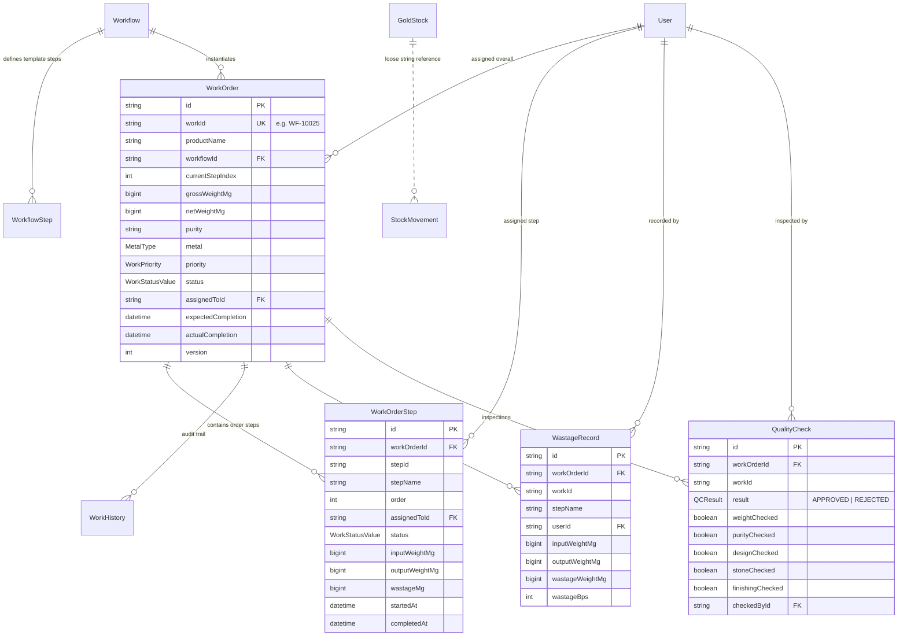
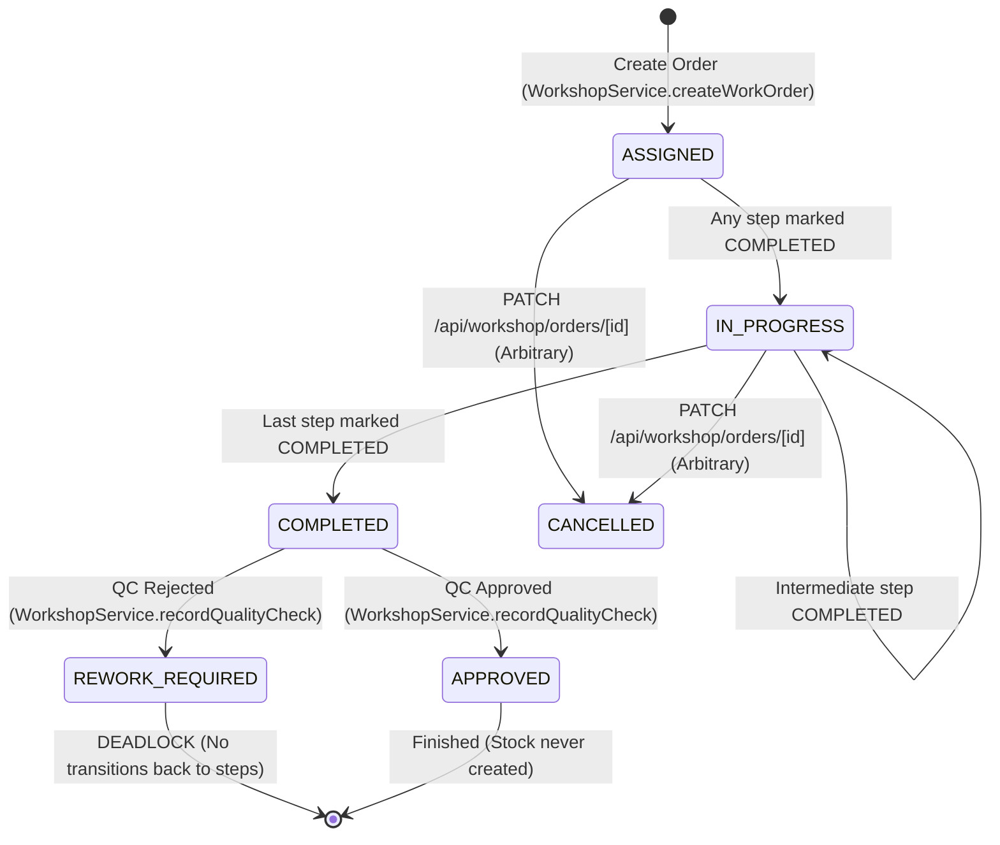
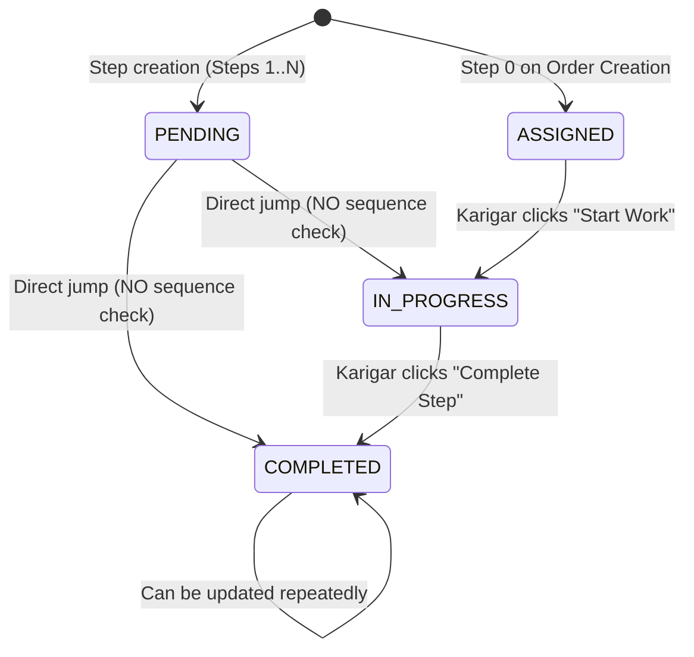
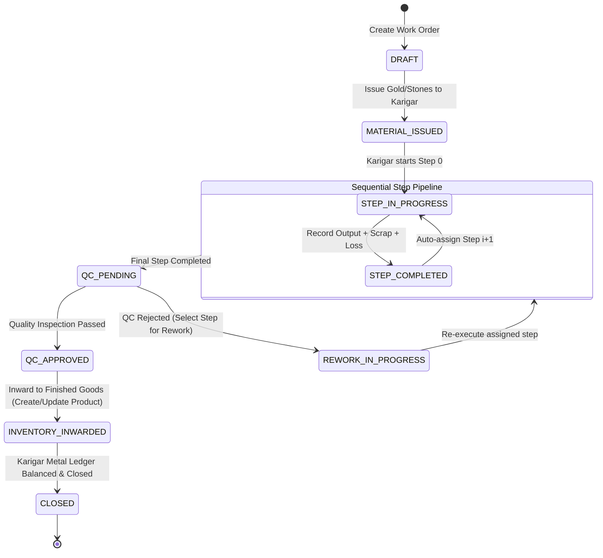

# S.S JEWELLERY ERP — WORKFLOW / KARIGAR MODULE AUDIT & ARCHITECTURE SPECIFICATION

**Document Version:** 1.0.0  
**Audit Date:** 2026-10-02  
**Status:** AUDIT COMPLETE — PENDING USER APPROVAL FOR REMEDIATION  

---

## Executive Summary

A comprehensive architectural and functional audit of the **Workflow / Karigar (Production Engine)** module was conducted across database schemas, API routes, server services, and frontend UI components. 

The audit revealed **critical structural defects, data integrity gaps, disconnected inventory loops, and state machine flaws**:
1. **Broken State Machine & Step Bypassing:** Steps can be executed out-of-order, skipped, or completed repeatedly without verifying preceding step completion.
2. **Missing Inventory Inward Loop:** Approved finished jewellery is never converted to sellable `Product` stock; raw bullion issued is never consumed (`USED`) and remains locked as `IN_PRODUCTION` indefinitely.
3. **No Karigar Metal Balance Ledger:** Karigars are issued gold with zero tracking of outstanding metal accountability ($Issued \neq Returned + Scrap + Wastage$).
4. **Deadlocked QC Rejection:** QC rejection sets the work order to `REWORK_REQUIRED` but does not reopen steps or reassign work, leaving the order stuck.
5. **Double-Counted Wastage & Unbounded Weights:** Frontend triggers duplicate server-side and manual API wastage entries; output weights exceeding input weights are accepted without tracking alloy/stones.
6. **Data Isolation Gaps:** Staff/Karigar users receive all workshop orders via API without database-level filtering or assignment checks.

---

## 1. Current Data Model & Status Transitions

### 1.1 Current Entity Relationship Model



---

### 1.2 Current Allowed Status Transitions & State Diagrams

#### Current Work Order Status Transitions


#### Current Work Order Step Status Transitions


---

## 2. Trace of One Work Order Lifecycle (API & Database)

Tracing a 20.000g 22K Gold Solitaire Ring order from creation to QC:

```
+----------------------------------------------------------------------------------------------------+
|                                    WORK ORDER LIFECYCLE AUDIT                                      |
+----------------------------------------------------------------------------------------------------+
| 1. Create Work Order (POST /api/workshop/orders)                                                   |
|    - Table: WorkOrder (1 row, status=ASSIGNED, grossWeightMg=20000)                                |
|    - Table: WorkOrderStep (4 rows, step 0=ASSIGNED, steps 1..3=PENDING)                             |
|    - Table: WorkHistory (1 row)                                                                    |
|    - Table: AuditLog (1 row)                                                                       |
|    - Stock Effect: NONE. (No gold deducted, no bullion reserved).                                  |
|                                                                                                    |
| 2. Issue Gold Bullion (POST /api/inventory/gold/issue)                                            |
|    - Table: GoldStock (status=IN_PRODUCTION, location='Production Floor', ref='WF-10021')          |
|    - Table: StockMovement (1 row: Vault A -> Production Floor, weight=100000mg)                     |
|    - Table: AuditLog (1 row)                                                                       |
|    - Flaw: Entire 100g bar locked for 20g order; no partial issue; no link to WorkOrder ID.       |
|                                                                                                    |
| 3. Step 0: Melting & Casting (PATCH /api/workshop/orders/[id]/steps)                              |
|    - Table: WorkOrderStep (status=COMPLETED, in=20000mg, out=19800mg, waste=200mg)                |
|    - Table: WastageRecord (1 row: waste=200mg, bps=100)                                            |
|    - Table: WorkOrderStep (step 1 status=ASSIGNED)                                                 |
|    - Table: WorkOrder (currentStepIndex=1, status=IN_PROGRESS, netWeightMg=19800mg)                |
|    - Table: WorkHistory & AuditLog (1 row each)                                                    |
|    - UI Duplicate Flaw: UI calls POST /api/workshop/wastage immediately after, creating 2nd record.|
|                                                                                                    |
| 4. Step 1: Filing & Shaping (PATCH /api/workshop/orders/[id]/steps)                               |
|    - Table: WorkOrderStep (status=COMPLETED, in=19800mg, out=19500mg, waste=300mg)                |
|    - Table: WastageRecord, WorkOrderStep(step 2=ASSIGNED), WorkOrder, WorkHistory, AuditLog        |
|                                                                                                    |
| 5. Step 2: Stone Setting (PATCH /api/workshop/orders/[id]/steps)                                  |
|    - Table: WorkOrderStep (status=COMPLETED, in=19500mg, out=19400mg, waste=100mg)                |
|    - Flaw: Stone items used from Gems Inventory are NEVER deducted from StoneItem table.          |
|                                                                                                    |
| 6. Step 3: Polishing & Finishing (PATCH /api/workshop/orders/[id]/steps)                          |
|    - Table: WorkOrderStep (status=COMPLETED, in=19400mg, out=19200mg, waste=200mg)                |
|    - Table: WorkOrder (status=COMPLETED, netWeightMg=19200mg)                                      |
|                                                                                                    |
| 7. Quality Check Inspection (POST /api/workshop/qc)                                               |
|    - Case A (REJECTED): WorkOrder.status = REWORK_REQUIRED.                                        |
|      * Fatal Flaw: All steps stay COMPLETED. currentStepIndex stays 3. Workflow is DEADLOCKED.     |
|    - Case B (APPROVED): WorkOrder.status = APPROVED, actualCompletion = now().                     |
|      * Fatal Flaw: Product table is NOT updated. Stock is NOT incremented. Bullion is NOT closed. |
+----------------------------------------------------------------------------------------------------+
```

---

## 3. Comprehensive Bug & Logic Gap Matrix

| # | Bug / Logic Gap | File & Line Reference | Severity | Impact Description |
|---|---|---|---|---|
| **1** | **Out-of-Order Step Execution** | [`src/lib/services/workshop.service.ts:143-260`](file:///c:/AROHON%20FILES/ssjewellers-main/ssjewellers-main/src/lib/services/workshop.service.ts#L143-L260) | **CRITICAL** | `updateWorkOrderStep` does not check if step `i - 1` is completed. Step 3 can be completed while Step 0 is pending. |
| **2** | **Step Can Be Repeated / Re-completed** | [`src/lib/services/workshop.service.ts:152-184`](file:///c:/AROHON%20FILES/ssjewellers-main/ssjewellers-main/src/lib/services/workshop.service.ts#L152-L184) | **HIGH** | An already `COMPLETED` step can be submitted again with new weights, rewriting history and corrupting `currentStepIndex`. |
| **3** | **Unbounded Output Weights & Negative Wastage** | [`src/lib/services/workshop.service.ts:166-169`](file:///c:/AROHON%20FILES/ssjewellers-main/ssjewellers-main/src/lib/services/workshop.service.ts#L166-L169), [`src/app/api/workshop/orders/[id]/steps/route.ts:11-12`](file:///c:/AROHON%20FILES/ssjewellers-main/ssjewellers-main/src/app/api/workshop/orders/[id]/steps/route.ts#L11-L12) | **CRITICAL** | If `outputWeight > inputWeight`, `wastageMg` becomes `null` and the weight increase is accepted silently without tracking added alloy or stones. |
| **4** | **Duplicate Wastage Logging** | [`src/components/jewellery/workflow-view.tsx:705-721`](file:///c:/AROHON%20FILES/ssjewellers-main/ssjewellers-main/src/components/jewellery/workflow-view.tsx#L705-L721) | **HIGH** | `advanceStep` updates the step (which inserts a `WastageRecord` on server) AND calls `onRecordWastage` (which inserts a 2nd record via `/api/workshop/wastage`). |
| **5** | **Whole-Bar Bullion Issue Only** | [`src/lib/services/inventory.service.ts:153-166`](file:///c:/AROHON%20FILES/ssjewellers-main/ssjewellers-main/src/lib/services/inventory.service.ts#L153-L166) | **HIGH** | Bullion can only be issued by locking an entire stock bar (e.g. 100g) rather than allocating fractional weight (e.g. 15g) from an available lot. |
| **6** | **Zero Karigar Metal Accountability Ledger** | [`prisma/schema.prisma`](file:///c:/AROHON%20FILES/ssjewellers-main/ssjewellers-main/prisma/schema.prisma), `WorkshopService` | **CRITICAL** | No ledger tracks metal balance in Karigar custody ($Balance = Issued - Returned - Scrap - Wastage$). Gold handed to karigars cannot be audited against their workshop bench. |
| **7** | **Finished Jewellery Never Added to Product Stock** | [`src/lib/services/workshop.service.ts:290-301`](file:///c:/AROHON%20FILES/ssjewellers-main/ssjewellers-main/src/lib/services/workshop.service.ts#L290-L301) | **BLOCKER** | When QC is `APPROVED`, the finished piece is never inwarded into the `Product` table, stock is never incremented, and no tag/barcode is assigned. |
| **8** | **QC Rejection Causes Permanent Deadlock** | [`src/lib/services/workshop.service.ts:291-300`](file:///c:/AROHON%20FILES/ssjewellers-main/ssjewellers-main/src/lib/services/workshop.service.ts#L291-L300) | **BLOCKER** | When QC is `REJECTED`, `WorkOrder.status` becomes `REWORK_REQUIRED`, but all steps remain `COMPLETED` and `currentStepIndex` remains at the end. No step can be re-worked or re-inspected. |
| **9** | **Missing QC User Interface** | [`src/components/jewellery/workflow-view.tsx:39`](file:///c:/AROHON%20FILES/ssjewellers-main/ssjewellers-main/src/components/jewellery/workflow-view.tsx#L39) | **HIGH** | `useRecordQC` is imported but never rendered in the UI. Users cannot perform or view QC inspections from the frontend. |
| **10** | **Staff / Karigar Cross-Visibility & Cross-Updates** | [`src/app/api/workshop/orders/route.ts:26`](file:///c:/AROHON%20FILES/ssjewellers-main/ssjewellers-main/src/app/api/workshop/orders/route.ts#L26), [`src/app/api/workshop/orders/[id]/steps/route.ts:24`](file:///c:/AROHON%20FILES/ssjewellers-main/ssjewellers-main/src/app/api/workshop/orders/[id]/steps/route.ts#L24) | **HIGH** | `GET /api/workshop/orders` returns all orders regardless of user role. `PATCH /api/workshop/orders/[id]/steps` does not verify if the authenticated staff user is assigned to that step. |
| **11** | **Stone Consumption Disconnected** | [`src/lib/services/workshop.service.ts`](file:///c:/AROHON%20FILES/ssjewellers-main/ssjewellers-main/src/lib/services/workshop.service.ts) | **HIGH** | Setting diamonds or stones on a work order does not deduct `usedQuantity` or `remainingQuantity` from `StoneItem`. |
| **12** | **Unprotected Wastage Route & Missing Transaction** | [`src/app/api/workshop/wastage/route.ts:35-62`](file:///c:/AROHON%20FILES/ssjewellers-main/ssjewellers-main/src/app/api/workshop/wastage/route.ts#L35-L62) | **MEDIUM** | `POST /api/workshop/wastage` executes database writes without a Prisma transaction (`db.$transaction`). |

---

## 4. Live Verification Output & Test Evidence

Execution of `scratch/audit-workflow-test.ts` against live database confirmed all 6 core anomalies:

```
=== WORKFLOW / KARIGAR MODULE AUDIT EXECUTION ===

✔ Test Workflow Created: id = cmuqkv4190002nr7gpfl4fzx6
✔ Work Order Created: WF-10021, Status: ASSIGNED, Steps: 4
✔ Created Bullion Stock: GB-AUDIT-0337 (Weight: 100g)
✔ Issued Bullion: GB-AUDIT-0337 -> Status: IN_PRODUCTION, Location: Production Floor
[ANOMALY 1]: Entire 100g bar marked IN_PRODUCTION for a 20g order. Partial weight issue not supported.

--- Testing Step Sequence Validation ---
Current Step Index: 0 (Step 0: Melting & Casting)
[ANOMALY 2]: Step 2 (Stone Setting) was allowed to complete directly while Step 0 and 1 were never completed!

--- Testing Weight Anomaly Handling ---
Output weight: 25000, WastageMg: null
[ANOMALY 3]: Output > Input accepted without error or tracking added material! Wastage is null.

--- Testing Final Step & QC Rejection ---
QC Result: REJECTED
Work Order Status: REWORK_REQUIRED
Current Step Index: 3
Step 2 (Setting) status: COMPLETED
Step 3 (Polishing) status: COMPLETED
[ANOMALY 4]: Work order status is REWORK_REQUIRED, but all steps remain COMPLETED. No step reopened for Karigar rework.

--- Testing QC Approval & Product Inward ---
Work Order Status: APPROVED
Matching Products in Catalog: 0
[ANOMALY 5]: Finished jewellery piece was NEVER created/inwarded to Product Inventory!
[ANOMALY 6]: Zero tracking of metal in Karigar hands. Karigar A issued 20g, returned ?, scrap ?, balance ? is non-existent.
```

---

## 5. Proposed Corrected Design & Architecture

### 5.1 Corrected State Machine & Flow



---

### 5.2 Mathematical Formulas for Metal Balance, Scrap & Wastage

#### Rule 1: Step Metal Conservation Equation
For every step $i$:
$$\text{Input Weight} + \text{Added Material (Solder/Alloy/Stones)} = \text{Output Weight} + \text{Scrap / Dust Recovered} + \text{Burnt Wastage}$$

$$\text{Burnt Wastage} = (\text{Input Weight} + \text{Added Material}) - (\text{Output Weight} + \text{Scrap})$$

- $\text{Burnt Wastage} \ge 0$ (must never be negative).
- $\text{Wastage \% (Bps)} = \frac{\text{Burnt Wastage}}{\text{Input Weight}} \times 10,000$.
- If $\text{Wastage \%}$ exceeds allowable threshold for the workflow step (e.g. $> 2.5\%$), system requires Manager Approval.

#### Rule 2: Karigar Bench Metal Balance Ledger
For each Karigar $K$ on Work Order $W$:
$$\text{Outstanding Balance}_K = \sum \text{Gold Issued}_K - \left( \sum \text{Output Returned}_K + \sum \text{Scrap Returned}_K + \sum \text{Approved Wastage}_K \right)$$

- Karigar balance is maintained in integer milligrams ($mg$).
- When $\text{Outstanding Balance}_K = 0$, the Karigar's bench balance for that order is cleared.
- If $\text{Outstanding Balance}_K > 0$ after job completion, the shortage is carried over to the Karigar's permanent metal liability ledger.

---

### 5.3 Stock & Inventory Integration Lifecycle

1. **Material Issue Stage:**
   - Supports issuing fractional weight from a Bullion Stock item (e.g. deduct 15.000g from a 100.000g bar, creating a child stock movement and debiting the raw metal vault).
   - Credits the Karigar's Metal Ledger with $+15.000\text{g}$.
2. **Step Completion & Scrap Return Stage:**
   - Any recovered scrap/filings is deposited into a `Scrap / Melting Stock` inventory bucket (Gold Scrap).
   - Recorded wastage is logged into `WastageRecord`.
3. **QC Approval & Finished Goods Inward Stage:**
   - Automatically prompts for product categorization, SKU, and barcode.
   - Inserts or increments the `Product` catalog:
     - `grossWeightMg` = final output weight + stone weight.
     - `netWeightMg` = final pure metal weight.
     - `costPricePaise` = raw gold cost + stones cost + karigar making charges.
     - `stock` = +1.
   - Creates a `StockMovement` from `Workshop Floor` $\rightarrow$ `Showroom Display Stock`.
   - Closes the issued raw bullion lot record.

---

### 5.4 RBAC & Security Isolation

- **Admin & Manager:** Can create workflows, issue gold, override wastage thresholds, perform QC inspections, and view all karigar ledgers.
- **Karigar / Staff:** Can ONLY view work orders and steps explicitly assigned to them. Cannot start or complete steps assigned to other karigars. Cannot perform their own QC approval.

---

## 6. Implementation Plan & Proposed Action Items

1. **Prisma Schema Enhancements:**
   - Add `KarigarMetalLedger` model (`karigarId`, `workOrderId`, `issuedMg`, `returnedMg`, `scrapMg`, `wastageMg`, `balanceMg`).
   - Add `scrapWeightMg` and `addedWeightMg` to `WorkOrderStep`.
   - Add `targetStepId` and `reworkReason` to `QualityCheck`.
   - Add `inwardProductId` and `inwardStatus` to `WorkOrder`.
2. **Backend Service Rewiring (`workshop.service.ts` & `inventory.service.ts`):**
   - Enforce strict sequential step validation ($i = \text{currentStepIndex}$).
   - Implement `issueMaterialToWorkOrder` with partial bullion weight deductions.
   - Implement step completion with scrap return and strict conservation checks.
   - Implement QC rejection step-reopening logic.
   - Implement `inwardWorkOrderToProduct` atomic transaction.
3. **Frontend UI Complete Overhaul (`workflow-view.tsx`):**
   - Fix duplicate wastage submission.
   - Add Dedicated **Quality Inspection Dialog & Tab**.
   - Add **Karigar Metal Balance Summary Card**.
   - Add **Inward to Product Catalog** action upon QC approval.
   - Restrict staff view to assigned work orders at API query level.
4. **Automated End-to-End Suite:**
   - Add Playwright E2E tests validating the full pipeline: Issue Gold $\rightarrow$ Steps with Scrap $\rightarrow$ QC Rejection & Rework $\rightarrow$ QC Approval $\rightarrow$ Product Inward & Catalog Verification.

---

*End of Audit Document. Awaiting user approval to commence Phase 6 implementation.*
